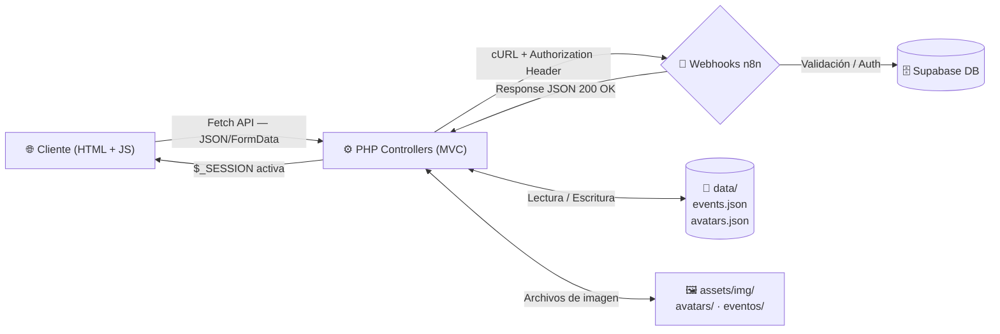
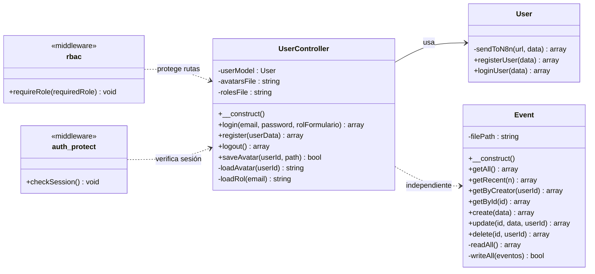
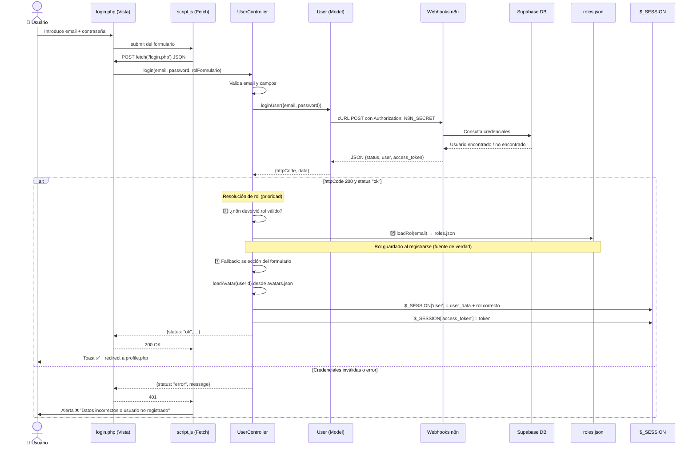

<div align="center">

<br/>


<br/><br/>

# 🎓 EduBook Web

### Centralizando la Vida Académica — Eventos, Charlas y Talleres Universitarios en un Solo Lugar.

<br/>


</div>

---

## 📑 Tabla de Contenidos

1. [Acerca del Proyecto](#-acerca-del-proyecto)
2. [Características Principales](#-características-principales)
3. [Arquitectura y Tecnologías](#-arquitectura-y-tecnologías)
   - [Ecosistema General](#ecosistema-general)
   - [Diagrama de Clases](#diagrama-de-clases)
   - [Diagrama de Secuencia — Login Flow](#diagrama-de-secuencia--login-flow)
   - [Tecnologías Clave del Stack](#tecnologías-clave-del-stack)
4. [Estructura del Proyecto (MVC)](#-estructura-del-proyecto-mvc)
5. [Roles de Usuario y RBAC](#-roles-de-usuario-y-rbac)
6. [Asistente Virtual (Chatbot)](#-asistente-virtual-chatbot)
7. [Prerrequisitos e Instalación](#-prerrequisitos-e-instalación)
8. [Guía de Contribución](#-guía-de-contribución)
9. [Licencia](#-licencia)

---

## 📖 Acerca del Proyecto

**EduBook** nace para resolver uno de los problemas más comunes en los campus universitarios: **la dispersión de la información sobre eventos extracurriculares**.

Es una plataforma web centralizada donde las instituciones pueden publicar charlas, talleres y seminarios, y los estudiantes pueden descubrirlos, inscribirse y organizar su agenda académica de manera intuitiva.

La aplicación combina:
- Una arquitectura **MVC limpia en PHP** para toda la lógica de servidor.
- **Webhooks serverless (n8n + Supabase)** para autenticación segura, evitando bases de datos locales.
- **Almacenamiento JSON local** para la gestión de eventos y avatares persistentes sin infraestructura adicional.

> ✅ Autorizado por el docente para uso de n8n y Supabase como backend de autenticación.

---

## ✨ Características Principales

| Funcionalidad | Descripción |
|:---|:---|
| 🔐 **Auth Serverless** | Login y registro validados en tiempo real vía webhooks n8n + Supabase |
| 👤 **Registro Dual (Tabs)** | Formularios separados para **Explorador** y **Manager** con campos específicos |
| 📸 **Avatar Persistente** | La foto de perfil del Manager se guarda en servidor y se recupera al re-ingresar |
| 🎫 **CRUD de Eventos** | Managers crean, editan y eliminan sus propios eventos; Exploradores los ven e inscriben |
| 🔒 **RBAC Completo** | Rutas y componentes protegidos según el rol del usuario en cada petición |
| 🗃️ **Eventos Permanentes** | Eventos del sistema (`creador_id: system`) siempre visibles y no eliminables |
| 🔍 **Buscador con Filtros** | Filtrado por texto, categoría y modalidad en tiempo real (client-side) |
| 📱 **Mobile-First** | Diseño responsive con CSS Vanilla, Bottom Navigation en móvil |
| 🍞 **Notificaciones Toast** | Sistema de alertas animadas para feedback inmediato al usuario |
| 📅 **Agenda y Favoritos** | Vistas exclusivas de Exploradores para organizar su actividad |

---

## 🎯 Cumplimiento: Práctica 6 (CRUD & Backend)

Este proyecto ha sido adaptado para cumplir con los requerimientos de la **Práctica 6**, integrando la arquitectura Serverless (n8n + Supabase) autorizada previamente por el equipo docente como alternativa a la pila tradicional (MySQL + PDO local).

### 1. CRUD de Usuario (4 puntos)
*   **Create & Read (Login/Registro):** Funcionales vía webhooks hacia Supabase Auth.
*   **Update (Actualizar datos):** Los usuarios pueden modificar su información personal desde la vista de Perfil.
*   **Update (Cambiar Password):** Integrado en el panel de seguridad del perfil del usuario y en la pantalla de login (funcionalidad de "Olvidaste tu contraseña").
*   **Delete (Darse de baja):** El usuario puede eliminar su cuenta definitivamente (borrado en cascada gestionado con API de administrador).

### 2. CRUD Específico del Proyecto — Eventos (4 puntos)
*   **Create (Crear):** Los usuarios con rol `Manager` pueden crear y publicar nuevos eventos (`crear_evento.php`).
*   **Read (Leer):** Listado global en el explorador, vista detallada individual (`evento.php`) y dashboard personal.
*   **Update (Actualizar):** Los managers pueden editar cualquier detalle de sus propios eventos desde el panel de gestión.
*   **Delete (Eliminar):** Los managers pueden borrar sus eventos. (Los eventos base con `creador_id: system` están protegidos).

### 3. Requerimientos No Funcionales
*   **Base de Datos y Conexión:** Requisito de MySQL + PDO sustituido y aprobado por **Supabase (PostgreSQL) + n8n + PHP cURL**.
*   **Estructura MVC y Controladores:** Cumplido estrictamente (Ver sección de estructura).
*   **Encriptación de contraseñas:** Delegado al sistema criptográfico avanzado de **Supabase Auth** (superando el estándar de `password_hash()` exigido).

---

## 🏗️ Arquitectura y Tecnologías

El proyecto sigue el patrón **Modelo-Vista-Controlador (MVC)**, separando de forma estricta la lógica de negocio, el enrutamiento y la presentación.

### Ecosistema General



---

### Diagrama de Clases



---

### Diagrama de Secuencia — Login Flow



---

### Tecnologías Clave del Stack

| Capa | Tecnología | Rol |
|:---|:---|:---|
| **Frontend** | HTML5 Semántico | Estructura de vistas |
| **Frontend** | CSS3 Vanilla — un único `style.css` | Diseño dark mode + responsive (sin estilos inline) |
| **Frontend** | JavaScript ES6+ (Fetch API, FormData) | Peticiones asíncronas, uploads, toasts y chatbot |
| **Backend** | PHP 8.x (MVC) | Controladores, modelos, vistas dinámicas |
| **Backend** | Sesiones PHP nativas | Gestión de autenticación stateful |
| **Backend** | PHP cURL | Proxy de peticiones a n8n |
| **Auth** | [n8n](https://n8n.io/) Webhooks | Orquestador serverless de auth + chatbot |
| **Auth DB** | [Supabase](https://supabase.com/) | Base de datos de usuarios (PostgreSQL) |
| **Persistencia** | JSON local (`data/`) | Eventos, avatares, roles y datos de perfil por email |
| **Archivos** | Sistema de ficheros PHP | Imágenes de eventos y avatares |
| **IA / Chatbot** | n8n + LLM vía webhook | Asistente virtual integrado en todas las páginas |

---

## 📂 Estructura del Proyecto (MVC)

```text
📦 edubookweb/
 │
 ├── 📂 config/
 │   └── 📜 webhooks.php          ← Endpoints n8n, N8N_SECRET y ALLOWED_ORIGIN
 │
 ├── 📂 data/                     ← Persistencia local (NO versionar en producción)
 │   ├── 📜 events.json           ← Todos los eventos (incluye los del sistema)
 │   ├── 📜 avatars.json          ← Mapa userId → ruta de avatar persistida
 │   ├── 📜 roles.json            ← Mapa email → rol real (guardado al registrarse)
 │   └── 📜 users_data.json       ← Mapa email → {nombre, universidad} persistidos
 │
 ├── 📂 src/
 │   ├── 📂 controllers/
 │   │   ├── 📜 UserController.php  ← Login, Register, Logout, Avatar, Rol
 │   │   ├── 📜 auth_protect.php    ← Middleware: requiere sesión activa
 │   │   ├── 📜 rbac.php            ← Middleware: control de acceso por rol
 │   │   └── 📜 logout.php          ← Destruye sesión → redirect login
 │   │
 │   ├── 📂 models/
 │   │   ├── 📜 User.php            ← Wrapper cURL hacia webhooks n8n
 │   │   └── 📜 Event.php           ← CRUD completo sobre events.json
 │   │
 │   └── 📂 views/
 │       ├── 📂 assets/
 │       │   ├── 📂 img/
 │       │   │   ├── 📂 avatars/    ← Fotos de perfil subidas por Managers
 │       │   │   └── 📂 eventos/    ← Imágenes de eventos subidas por Managers
 │       │   ├── 📜 script.js       ← Fetch API, Toast, redirecciones
 │       │   └── 📜 style.css       ← Hoja de estilos principal
 │       │
 │       ├── 📂 partials/
 │       │   ├── 📜 sidebar.php     ← Sidebar dinámico con filtro de rol
 │       │   └── 📜 chatbot.php     ← Widget flotante del asistente IA
 │       │
 │       ├── 📜 login.php           ← Auth (POST + HTML): login dual por rol
 │       ├── 📜 register.php        ← Auth (POST + HTML): tabs Explorador / Manager
 │       ├── 📜 index.php           ← Dashboard principal con accesos rápidos
 │       ├── 📜 buscar.php          ← Buscador de eventos con filtros en tiempo real
 │       ├── 📜 evento.php          ← Detalle de evento
 │       ├── 📜 crear_evento.php    ← Formulario de creación (solo Managers)
 │       ├── 📜 editar_evento.php   ← Edición de evento propio (solo el creador)
 │       ├── 📜 panel.php           ← Panel de gestión de eventos (solo Managers)
 │       ├── 📜 profile.php         ← Perfil de usuario + cambio de foto
 │       ├── 📜 calendario.php      ← Agenda (solo Exploradores)
 │       └── 📜 favoritos.php       ← Guardados (solo Exploradores)
 │
 ├── 📂 workflows/                 ← Backups de flujos n8n para importar
 │   ├── 📜 EduBook - Login.json    ← Lee user_metadata de Supabase; valida por access_token
 │   ├── 📜 EduBook - Registro.json ← Detecta email ya registrado en español
 │   ├── 📜 EduBook - Actualizar Password.json ← Busca UUID por email y actualiza contraseña
 │   ├── 📜 EduBook - Eliminar Cuenta.json     ← Elimina usuario permanentemente vía Admin API
 │   └── 📜 EduBook - Chatbot.json  ← Workflow del asistente virtual con prompt del proyecto
 │
 └── 📜 README.md
```

---

## 👥 Roles de Usuario y RBAC

EduBook implementa un sistema de **Control de Acceso Basado en Roles (RBAC)** a nivel de servidor en cada petición, mediante `rbac.php` y `auth_protect.php`.

### Tabla de Permisos

| Funcionalidad | 🎒 Explorador | 🏛️ Manager |
|:---|:---:|:---:|
| Ver eventos publicados | ✅ | ✅ |
| Buscar y filtrar eventos | ✅ | ✅ |
| Inscribirse a un evento | ✅ | ✅ |
| Ver su perfil | ✅ | ✅ |
| Mi Calendario | ✅ | ❌ |
| Mis Favoritos | ✅ | ❌ |
| **Cambiar foto de perfil** | ❌ | ✅ |
| **Foto de perfil al registrarse** | ❌ | ✅ |
| **Crear eventos** | ❌ | ✅ |
| **Editar sus propios eventos** | ❌ | ✅ |
| **Eliminar sus propios eventos** | ❌ | ✅ |
| **Panel de Gestión** | ❌ | ✅ |
| Eliminar eventos del sistema | ❌ | ❌ |
| **Usar el chatbot asistente** | ✅ | ✅ |

> [!IMPORTANT]
> Los eventos con `creador_id: "system"` son **permanentes**. Ningún usuario, ni siquiera un Manager, puede eliminarlos. Son los eventos de relleno que siempre aparecen en la plataforma.

> [!NOTE]
> El rol se resuelve siempre con esta prioridad: **n8n/Supabase** → **`data/roles.json`** (guardado al registrarse) → selección del formulario de login. Esto garantiza que un usuario registrado como Explorador nunca pueda obtener rol Manager aunque lo seleccione en el login.

---

## 🤖 Asistente Virtual (Chatbot)

EduBook integra un **asistente IA flotante** disponible en todas las páginas autenticadas. Permite al usuario (o al profesor durante la evaluación) preguntar sobre la arquitectura, tecnologías y decisiones de diseño del proyecto.

### Características

- **Botón flotante** dorado en la esquina inferior derecha
- **Animación de escritura** (tres puntos) mientras el modelo procesa
- **Badge de notificación** cuando llega una respuesta con el chat cerrado
- **Sesión persistente** por pestaña (sessionId aleatorio)
- **Prompt del sistema embebido** en PHP con toda la documentación del proyecto

### Flujo técnico

```
Usuario escribe pregunta
→ JS POST a N8N_CHATBOT_URL  { chatInput, sessionId, systemPrompt }
→ n8n procesa con LLM usando el systemPrompt del proyecto
→ Respuesta aparece en el panel del chat
```

### Configuración

El endpoint del chatbot se define en `config/webhooks.php`:

```php
define('N8N_CHATBOT_URL', 'https://n8n.kairasystems.com/webhook/edubook-chatbot/chat');
```

El workflow de n8n se importa desde `workflows/EduBook - Chatbot.json`.

> [!TIP]
> El chatbot está preentrenado con toda la información del proyecto: stack, arquitectura MVC, flujo de login, descripción de roles, decisiones de diseño y más. Es ideal para responder preguntas del docente durante la defensa.

---

## ⚙️ Prerrequisitos e Instalación

### 1. Requisitos del Sistema

- **PHP 8.0 o superior** — con extensión **`curl`** habilitada.
- **Servidor web local**: XAMPP, WAMP, Laragon, MAMP, o el Built-in Server de PHP.
- **Git** para clonar el repositorio.
- *(Para autenticación real)* Una instancia de **n8n** activa (self-hosted o cloud) con los workflows importados desde `/workflows/`.

### 2. Clonar el Repositorio

```bash
git clone https://github.com/ElyasIT/edubookweb.git
cd edubookweb
```

### 3. Configurar los Webhooks

Edita el archivo `config/webhooks.php` con tus propios endpoints:

```php
<?php
// config/webhooks.php

define('N8N_WEBHOOK_LOGIN',    'https://TU_N8N/webhook/edubook/login');
define('N8N_WEBHOOK_REGISTER', 'https://TU_N8N/webhook/edubook/registro');
define('N8N_CHATBOT_URL',      'https://TU_N8N/webhook/edubook-chatbot/chat');
define('N8N_SECRET',           'TU_TOKEN_SECRETO');
define('ALLOWED_ORIGIN',       '*');
?>
```

> [!WARNING]
> **Nunca subas `N8N_SECRET` a un repositorio público.** Añade `config/webhooks.php` a tu `.gitignore` antes de hacer commit.

### 4. Importar los Workflows de n8n

1. Abre tu instancia de n8n.
2. Ve a **Workflows → Import from File**.
3. Importa los tres archivos JSON de la carpeta `/workflows/`:
   - `EduBook - Login.json` — lee `user_metadata` de Supabase, valida por `access_token`
   - `EduBook - Registro.json` — detecta email ya registrado con mensaje en español
   - `EduBook - Chatbot.json` — asistente IA con prompt del proyecto embebido
4. Activa los workflows y copia las URLs de los webhooks generados en `config/webhooks.php`.

### 5. Permisos de Escritura (Servidor)

Asegúrate de que el servidor web pueda escribir en estas rutas:

```bash
# Linux / macOS
chmod 755 data/
chmod 755 src/views/assets/img/avatars/
chmod 755 src/views/assets/img/eventos/
```

En Windows con XAMPP, estas carpetas ya tienen permisos de escritura por defecto.

### 6. Arrancar el Servidor de Desarrollo

**Opción A — PHP Built-in Server** (sin XAMPP):
```bash
php -S localhost:8000
```
Accede en: `http://localhost:8000/src/views/login.php`

**Opción B — XAMPP / WAMP**:
1. Copia la carpeta `edubookweb/` dentro de `htdocs/` (XAMPP) o `www/` (WAMP).
2. Inicia Apache desde el panel de control.
3. Accede en: `http://localhost/edubookweb/src/views/login.php`

---

## 🔧 Variables de Configuración

| Constante | Descripción | Ejemplo |
|:---|:---|:---|
| `N8N_WEBHOOK_LOGIN` | URL del webhook de n8n para login | `https://mi-n8n.com/webhook/login` |
| `N8N_WEBHOOK_REGISTER` | URL del webhook de n8n para registro | `https://mi-n8n.com/webhook/registro` |
| `N8N_CHATBOT_URL` | URL del webhook del chatbot IA | `https://mi-n8n.com/webhook/edubook-chatbot/chat` |
| `N8N_SECRET` | Token secreto enviado en el header `Authorization` | `EDUBOOK` |
| `ALLOWED_ORIGIN` | Origen permitido en CORS | `*` o dominio específico |

---

## 🐛 Problemas Conocidos y Soluciones

| Síntoma | Causa probable | Solución |
|:---|:---|:---|
| "Datos incorrectos o usuario no registrado" | n8n offline o workflow inactivo | Activar el workflow en n8n |
| Login con contraseña incorrecta deja entrar | Workflow de login desactualizado | Reimportar `EduBook - Login.json` (valida por `access_token`) |
| Nombre y universidad vacíos en el perfil | n8n no devuelve `user_metadata` | Reimportar `EduBook - Login.json`; los datos también se guardan en `users_data.json` |
| "Email ya registrado" no aparece en registro | Workflow de registro desactualizado | Reimportar `EduBook - Registro.json` |
| Chatbot no responde | Workflow de chatbot inactivo en n8n | Activar `EduBook - Chatbot.json` en n8n |
| La foto de perfil no se guarda | Sin permisos de escritura en `data/` o `avatars/` | `chmod 755` en las carpetas |
| El rol al hacer login es incorrecto | Usuario registrado antes de que existiera `roles.json` | Borra y vuelve a registrar, o edita `data/roles.json` manualmente |
| La foto del Manager al registrarse no aparece | `data/` sin permisos de escritura | `chmod 755 data/` y `chmod 755 assets/img/avatars/` |
| Error 500 al crear evento | Sin permisos en `assets/img/eventos/` | `chmod 755` en la carpeta |
| La sesión expira sola | `session.gc_maxlifetime` en `php.ini` demasiado bajo | Aumentar el valor o usar cookies |

---

## 🤝 Guía de Contribución

¡EduBook acepta contribuciones de la comunidad! Sigue estas directrices:

1. **Fork** el repositorio y clónalo localmente.
2. Crea una rama descriptiva:
   ```bash
   git checkout -b feature/NombreDeCaracteristica
   ```
3. Haz commits atómicos con mensajes semánticos:
   ```bash
   git commit -m "feat: añade filtro por fecha en el buscador"
   git commit -m "fix: corrige redirección tras logout en móvil"
   ```
4. Sube tu rama y abre un **Pull Request** detallando los cambios.

### Convenciones de Commits

| Prefijo | Uso |
|:---|:---|
| `feat:` | Nueva funcionalidad |
| `fix:` | Corrección de bug |
| `refactor:` | Refactorización sin cambio funcional |
| `style:` | Cambios de estilo / formato |
| `docs:` | Documentación |
| `chore:` | Tareas de mantenimiento |

---

## 📄 Licencia

Todo el código de este proyecto está publicado bajo la [**Licencia MIT**](LICENSE).

Eres libre de clonar, modificar, distribuir y usar este proyecto en aplicaciones académicas, personales y comerciales.

---

<div align="center">

**EduBook Web** · Desarrollado con ❤️ para revolucionar el acceso a la información universitaria.

<br/>

[](https://php.net)
[](https://n8n.io)
[](https://supabase.com)

</div>
