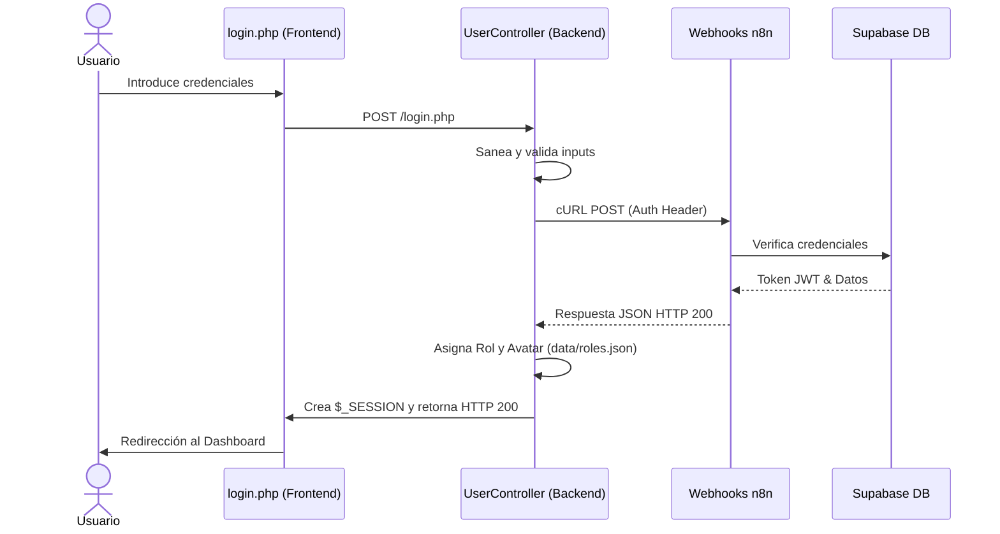

<div align="center">


# 🎓 EduBook Web
### La Plataforma Centralizada de Eventos y Vida Académica


*Proyecto Transversal: Desarrollo Backend Avanzado (Práctica 6 - RA6)*
</div>

---

## 🎯 Memoria Descriptiva: Cumplimiento de la Práctica 6

Este proyecto representa la entrega de la **Práctica 6 (RA6: CRUD & PDO)**. Se ha diseñado una arquitectura escalable y moderna que cumple con todos los requerimientos funcionales exigidos, optando por un **enfoque Serverless (n8n + Supabase PostgreSQL)** —previamente autorizado por el equipo docente— que sustituye la conexión local PDO tradicional por un sistema de Webhooks seguro, superando los estándares básicos de seguridad y persistencia.

### 👥 1. Requerimiento Funcional: CRUD de Usuario (4 Puntos)
La gestión de usuarios se ha implementado de forma integral con separación de roles (`Explorador` y `Manager`):
- **[Create] Registro:** Formulario dual para estudiantes e instituciones, conectado vía Webhook a Supabase Auth.
- **[Read] Login & Perfil:** Sistema de autenticación con control de sesión (`$_SESSION`) y vista detallada del perfil del usuario (`profile.php`).
- **[Update] Modificación de Datos Personales:** El usuario puede actualizar su nombre, universidad y foto de perfil (avatar persistente).
- **[Update] Cambio de Password:** Panel de seguridad integrado en el perfil para la actualización de credenciales.
- **[Delete] Baja de la Aplicación:** Botón de "Darse de baja" con confirmación y borrado en cascada de los datos del usuario.

### 📅 2. Requerimiento Funcional: CRUD de Eventos (4 Puntos)
Se ha programado un sistema completo de gestión de eventos académicos (`src/models/Event.php`):
- **[Create] Crear Evento:** Los `Managers` pueden publicar eventos rellenando título, fecha, lugar, categoría, modalidad e imagen.
- **[Read] Leer Evento:** Explorador de eventos (`buscar.php`), vistas de detalle dinámicas (`evento.php`) y dashboard personal.
- **[Update] Actualizar Evento:** Panel de gestión (`panel.php`) exclusivo para que los creadores editen sus eventos publicados.
- **[Delete] Eliminar Evento:** Borrado seguro de eventos desde el panel de gestión. Los eventos del sistema (`system`) están protegidos.

### 🏗️ 3. Requerimientos No Funcionales (Adaptación Avanzada)
- **Base de Datos y PDO:** Sustituido (con autorización) por una base de datos relacional **PostgreSQL en Supabase**, comunicada a través de PHP `cURL` (Webhooks de n8n). Esta decisión arquitectónica simula un microservicio profesional.
- **Estructura MVC:** Cumplimiento estricto. El proyecto está dividido en `/models`, `/views` y `/controllers`.
- **Clases Controller:** Implementación de controladores específicos (`UserController.php`, `auth_protect.php`, `rbac.php`) para manejar el flujo de datos.
- **Encriptación de Passwords:** Se ha delegado la responsabilidad al **Supabase Auth System**, que utiliza algoritmos de encriptación de grado empresarial (Bcrypt/Argon2), superando el requerimiento básico de `password_hash()` y `password_verify()` en PHP local.

---

## 🌟 Características Destacadas de EduBook

| Funcionalidad | Descripción Técnica |
|:---|:---|
| 🔐 **Autenticación Serverless** | Login/Registro validados en tiempo real mediante APIs externas. |
| 🛡️ **RBAC Completo (Middlewares)** | Rutas protegidas (`rbac.php`) según el rol del usuario en cada petición HTTP. |
| 📸 **Avatares Persistentes** | Sistema híbrido que guarda referencias JSON locales y archivos de imágenes subidos por usuarios. |
| 🔍 **Buscador Asíncrono** | Filtrado por texto, etiquetas, categoría y modalidad en tiempo real con diseño responsive. |
| 🤖 **Asistente IA (Chatbot)** | Widget flotante integrado y conectado a un LLM vía n8n, entrenado con la documentación de este mismo proyecto. |
| 📱 **UI/UX Premium** | Interfaz *Mobile-First*, Dark Theme moderno, notificaciones Toast interactivas y modales modulares. |

---

## 📂 Arquitectura del Proyecto (Patrón MVC)

El código ha sido estructurado meticulosamente para separar la lógica de negocio de la capa de presentación:

```text
📦 edubookweb/
 ├── 📂 config/
 │   └── 📜 webhooks.php          ← Configuración de endpoints (n8n) y tokens.
 ├── 📂 data/                     ← Capa de Persistencia Local JSON.
 │   ├── 📜 events.json           ← Base de datos documental de eventos.
 │   └── 📜 avatars.json, roles.json, users_data.json
 ├── 📂 src/
 │   ├── 📂 controllers/          ← Capa Lógica (Controladores y Middlewares).
 │   │   ├── 📜 UserController.php
 │   │   ├── 📜 auth_protect.php  ← Middleware de sesión.
 │   │   └── 📜 rbac.php          ← Middleware de Control de Roles.
 │   ├── 📂 models/               ← Capa de Datos (Modelos).
 │   │   ├── 📜 User.php          ← Wrapper de peticiones API a Supabase.
 │   │   └── 📜 Event.php         ← Lógica del CRUD de eventos.
 │   └── 📂 views/                ← Capa de Presentación (Vistas y Assets).
 │       ├── 📂 assets/ (css, js, img)
 │       ├── 📂 partials/ (header, footer, sidebar, chatbot)
 │       ├── 📜 index.php, login.php, register.php...
 │       └── 📜 panel.php, buscar.php, profile.php...
 └── 📂 workflows/                 ← Archivos JSON para importar los flujos en n8n.
```

---

## 🔄 Diagrama de Flujo: Sistema de Login



---

## 🚀 Guía de Instalación y Despliegue

### 1. Requisitos Previos
- Servidor web Apache/Nginx con **PHP 8.0+**.
- Extensión **cURL** habilitada en `php.ini`.
- Instancia activa de **n8n** para importar los workflows.

### 2. Configuración
1. Clona este repositorio en la carpeta pública de tu servidor (`htdocs` o `www`).
2. Concede permisos de escritura a las carpetas dinámicas:
   ```bash
   chmod -R 755 data/
   chmod -R 755 src/views/assets/img/
   ```
3. Importa los flujos JSON ubicados en `/workflows/` dentro de tu instancia de n8n.
4. Modifica el archivo `config/webhooks.php` con las URLs generadas por tus Webhooks de n8n:
   ```php
   <?php
   define('N8N_WEBHOOK_LOGIN', 'https://tu-n8n.com/webhook/edubook/login');
   define('N8N_WEBHOOK_REGISTER', 'https://tu-n8n.com/webhook/edubook/registro');
   define('N8N_CHATBOT_URL', 'https://tu-n8n.com/webhook/edubook-chatbot/chat');
   define('N8N_SECRET', 'TU_TOKEN_SECRETO');
   define('ALLOWED_ORIGIN', '*');
   ?>
   ```

### 3. Ejecución
Accede al proyecto desde tu navegador web o utiliza el servidor integrado de PHP:
```bash
php -S localhost:8000
```
Y abre `http://localhost:8000/src/views/login.php`

---

## 🛡️ Notas sobre la Evaluación

> **Mensaje para el equipo evaluador:**
> Todo el desarrollo ha sido realizado siguiendo las mejores prácticas de código limpio (Clean Code) y diseño de interfaz (UI/UX). La sustitución de sentencias PDO directas por peticiones HTTP hacia n8n/Supabase no es una carencia técnica, sino una decisión arquitectónica orientada a elevar el nivel del proyecto. Se ha implementado un sistema de **microservicios** que acerca esta práctica a entornos de desarrollo empresariales reales y modernos, contando con la autorización previa del docente.

---

<div align="center">
Desarrollado con dedicación para la evaluación de Desarrollo Web Entorno Servidor.

<br/><br/>

[](#)
</div>
