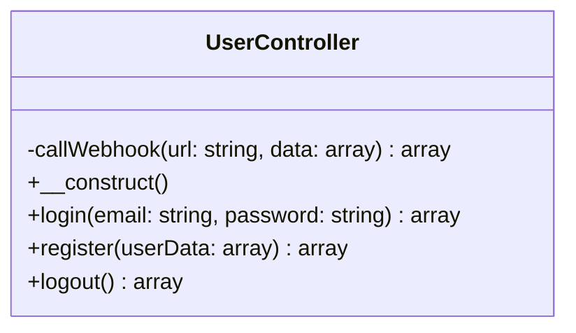
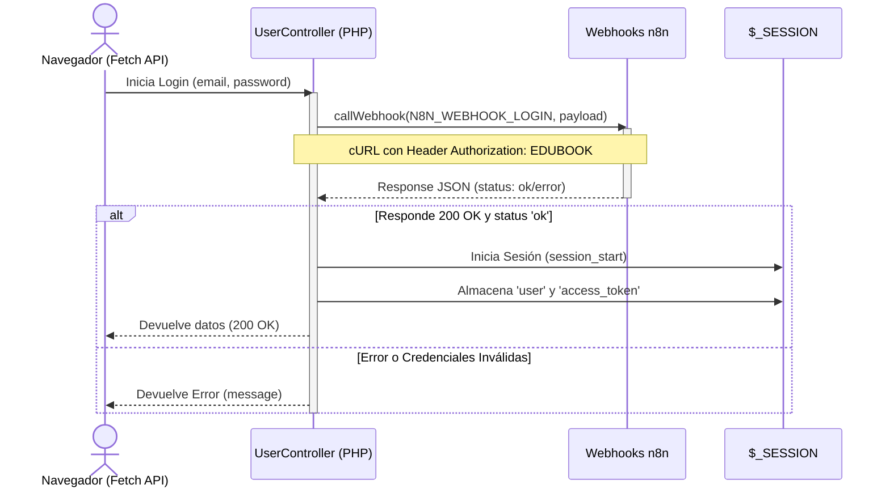

<div align="center">
  <br />
  <a href="https://github.com/ElyasIT/edubookweb" target="_blank">
    
  </a>
  <br />

  # 🎓 EduBook Web

  **Centralizando la Vida Académica: Eventos, Charlas y Talleres Universitarios en tu Bolsillo.**

  <p align="center">
    
    
    
    
    
  </p>
</div>

---

## 📑 Tabla de Contenidos

1. [Acerca del Proyecto](#-acerca-del-proyecto)
2. [Características Principales](#-características-principales)
3. [Arquitectura y Tecnologías](#-arquitectura-y-tecnologías)
    - [El Ecosistema (Diagrama)](#el-ecosistema-diagrama)
4. [Estructura del Proyecto (MVC)](#-estructura-del-proyecto-mvc)
5. [Roles de Usuario](#-roles-de-usuario)
6. [Prerrequisitos e Instalación](#-prerrequisitos-e-instalación)
7. [Guía de Contribución](#-guía-de-contribución)
8. [Licencia](#-licencia)

---

## 📖 Acerca del Proyecto

**EduBook** nace para solucionar un problema clásico en los campus universitarios: la dispersión de la información sobre eventos extracurriculares. 

Es una plataforma centralizada y accesible donde las instituciones pueden promocionar sus charlas, y los estudiantes pueden descubrirlas, inscribirse y gestionar su asistencia de manera intuitiva. Al usar una arquitectura híbrida entre PHP tradicional (patrón MVC) y webhooks serverless (**n8n**), EduBook demuestra que es posible crear aplicaciones robustas, escalables y altamente seguras enfocándose en una integración ágil por medio de microservicios sin requerir bases de datos relacionales locales y rígidas.

---

## ✨ Características Principales

- ⚡ **Severless Auth**: El inicio de sesión y el registro son validados asíncronamente a través de flujos en [n8n](https://n8n.io/).
- 📱 **Mobile-First & Responsive**: Interfaz de usuario (UI) moderna, pulida con CSS Vanilla y garantizada para funcionar en cualquier dispositivo móvil o de escritorio.
- 🔍 **Buscador Inteligente de Eventos**: Permite filtrar seminarios y talleres proactivamente.
- 📅 **Vista de Calendario Dinámica**: Visualiza tu agenda académica mensual de un solo vistazo con herramientas interactivas.
- 💾 **Gestor de Favoritos**: Guarda las conferencias que te interesan en tu área de usuario personal.
- 🔒 **Seguridad por Sesiones PHP**: Acceso protegido a rutas críticas manejado de forma limpia mediante abstracciones directas en los Controladores MVC.

---

## 🏗️ Arquitectura y Tecnologías

El proyecto se despliega bajo el paradigma modular **Modelo-Vista-Controlador (MVC)**, orientado a separar de forma estandarizada e inteligente la lógica de negocio, las peticiones HTTP y la interfaz gráfica.

### El Ecosistema (Diagrama General)

```mermaid
graph LR
    A[Cliente / Navegador (HTML/JS)] -->|Submit Data via Fetch (JSON/FormData)| B(PHP / Controladores MVC)
    B -->|Wrapper cURL + API Auth| C{Webhooks n8n (Serverless)}
    C -->|Validación / Lógica DB| D[(Base de Datos Externa)]
    C -->|Response (Token/Estado) 200 OK| B
    B -->|$_SESSION Start / Auth state| A
```

### Clase Principal: UserController

Para entender mejor el proxy de peticiones, aquí presentamos los diagramas de clases y de secuencia de nuestro controlador vital.

**Diagrama de Clases**


**Diagrama de Secuencia (Login Flow)**


### Tecnologías Clave del Stack

| Frontend | Backend & Lógica | Infraestructura Asíncrona |
| :--- | :--- | :--- |
| HTML5 Semántico y Accesible | PHP 8.x (Núcleo) | [n8n](https://n8n.io/) Webhooks (Backend-as-a-Service) |
| CSS3 (Variables, Flexbox, Grid) | Arquitectura Patrón MVC | Autenticación Segura |
| Vanilla JavaScript (Fetch API, DOM) | Manejo Avanzado de Webhooks | Microservicios REST |

---

## 📂 Estructura del Proyecto (MVC)

Nuestra base de código es intencionalmente limpia y modular. Al no acoplar lógica excesiva en las vistas, favorecemos la mantenibilidad:

```text
📦 edubookweb
 ┣ 📂 config                  # 🔧 Variables globales y configuración principal.
 ┃ ┗ 📜 webhooks.php          # Definición obligatoria de N8N_SECRET y endpoints API.
 ┣ 📂 src                     # 💻 Core de la aplicación.
 ┃ ┣ 📂 controllers           # 🎮 Controladores (Lógica y enrutamiento).
 ┃ ┃ ┣ 📜 UserController.php  # Controlador API (Maneja POST, Login, Auth con n8n).
 ┃ ┃ ┗ 📜 logout.php          # Termina la sesión PHP local y destruye cookies.
 ┃ ┣ 📂 models                # 📦 Entidades de datos y objetos de negocio.
 ┃ ┃ ┗ 📜 User.php            # Modelo estructural para representar al usuario en sesión.
 ┃ ┗ 📂 views                 # 👁️ Presentación (Vistas y templates devueltos al usuario).
 ┃   ┣ 📂 assets              # 🎨 Recursos estáticos procesados por el navegador.
 ┃   ┃ ┣ 📂 img               # Imágenes y logotipos (logo.png, etc).
 ┃   ┃ ┣ 📜 script.js         # Lógica frontend interactiva (modales, fetch).
 ┃   ┃ ┗ 📜 style.css         # Hoja de estilos principal (Design System).
 ┃   ┣ 📜 buscar.html         # Módulo UI: Motor de búsqueda y filtrado de eventos.
 ┃   ┣ 📜 calendario.html     # Módulo UI: Integración de vista de malla temporal mensual.
 ┃   ┣ 📜 evento.html         # Módulo UI: Detail-page de cada seminario/charla.
 ┃   ┣ 📜 favoritos.html      # Módulo UI: Colección curada por el usuario.
 ┃   ┣ 📜 index.html          # Vista inicial / Landing page (Home).
 ┃   ┣ 📜 login.php           # Vista híbrida de acceso y procesamiento de sesión de entrada.
 ┃   ┣ 📜 profile.html        # UI dashboard del perfil de usuario y configuración.
 ┃   ┗ 📜 register.php        # Vista híbrida de creación y enrutador proxy registral.
 ┗ 📜 README.md               # 📚 Documentación técnica (Este archivo).
```

---

## 👥 Roles de Usuario

El ecosistema de EduBook distingue claramente entre los niveles de autorización requeridos en los Controladores:

1. 🎒 **Explorador (Estudiantes)**: Cuentas base. Pueden explorar el catálogo de eventos, confirmar asistencias, gestionar su propio calendario y organizar guardados en favoritos.
2. 🏛️ **Manager (Universidades / Organizadores)**: Cuentas institucionales con capacidades administrativas para inyectar datos de nuevos seminarios en el ecosistema, editar metadatos y consultar telemetría de asistencia.

---

## ⚙️ Prerrequisitos e Instalación

Sigue estos pasos precisos para desplegar tu entorno de trabajo local en minutos.

### 1. Requisitos Previos

- **PHP 8.0** o superior activo en tu variable de entorno PATH.
- **Git** instalado en tu sistema.
- Un servidor web local tradicional (XAMPP, WAMP, Laragon, MAMP), o simplemente el *Built-in Server* nativo de PHP.
- *(Opcional)*: Una instancia activa de **n8n** (self-hosted o cloud) configurada con los webflows correspondientes a la API Auth para procesar los requests reales.

### 2. Clonar el Repositorio

Abre tu terminal y ejecuta:

```bash
git clone https://github.com/ElyasIT/edubookweb.git
cd edubookweb
```

### 3. Configuración Primordial de Entorno

El proyecto requiere parámetros vitales en `config/webhooks.php`. Es indispensable crearlo si no existe (el `.gitignore` podría estar obviando variables sensibles).

```php
<?php
// config/webhooks.php
define('N8N_WEBHOOK_LOGIN', 'https://n8n.kairasystems.com/webhook/edubook/login');
define('N8N_WEBHOOK_REGISTER', 'https://n8n.kairasystems.com/webhook/edubook/registro');
define('N8N_SECRET', 'EDUBOOK');
define('ALLOWED_ORIGIN', '*');
?>
```

> [!WARNING]  
> Asegúrate de no versionar de manera pública tus verdaderos *tokens webhooks* (N8N_SECRET) para evitar que terceros inyecten datos a tus flujos asíncronos en n8n.

### 4. Compilación y Arranque del Servidor

Para fines de desarrollo en un entorno de pruebas, basta con utilizar el propio motor de PHP en el directorio raíz:

```bash
php -S localhost:8000
```

Dirígete a tu navegador en `http://localhost:8000/src/views/login.php` y comienza a debuggear el sistema en profundidad.

---

## 🤝 Guía de Contribución

¡EduBook adopta activamente la colaboración de la comunidad Open Source! Sigue nuestras directrices recomendadas:

1. Realiza un `Fork` del proyecto.
2. Crea tu rama para una nueva característica (`git checkout -b feature/ImplementarNuevaVista`).
3. Realiza tus commits con mensajes descriptivos (`git commit -m 'feat: Añade controlador para reset password'`).
4. Haz push a tu fork remoto (`git push origin feature/ImplementarNuevaVista`).
5. Abre formalmente un **Pull Request**.

Para reportar bugs o disfuncionalidades en los controladores PHP o UI, utiliza el [Tablón de Issues](https://github.com/ElyasIT/edubookweb/issues).

---

## 📄 Licencia

Todo el código contenido en este proyecto está publicado bajo la [**Licencia MIT**](LICENSE). Eres absolutamente libre de clonar, refactorizar arquitectónicamente, modificar módulos de vistas, y distribuir la plataforma completa en tus proyectos comerciales, startups ed-tech o de uso académico personal.

<br />
<div align="center">
  <sub>Arquitecturado, programado y diseñado con ❤️ para revolucionar el acceso a la educación transversal en los campus.</sub>
</div>
